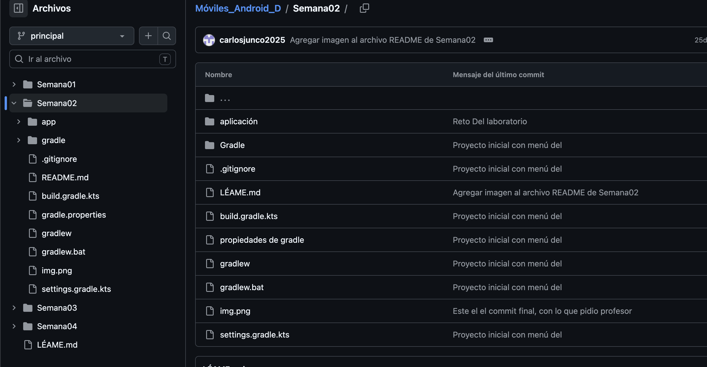

# Lab02Prueba - Sistema de Matrícula

## Descripción

Programa en Java, desarrollado en consola, sin uso de Programación Orientada a Objetos (sin clases propias, sin herencia). Simula un sistema de matrícula universitaria que recibe los datos de un estudiante y sus cursos, calcula el costo total y determina la carga académica y la forma de pago.

## Prompt original utilizado

Debemos hacer un sistema de matrícula sin POO ni nada de eso, desde lo más básico, todo tiene que ser como si lo hubiera hecho un principiante.

Tiene que contener:
- Datos del estudiante
- Cantidad de cursos
- Valor de cada crédito

Ejemplo:
- Mi nombre es Noe Oswaldo Escobal Huayana
- Tengo 2 cursos: Base de datos y Programación Móviles
- Crédito de BD es 4
- Crédito de Programación Móviles es 4
- Su valor de cada crédito sería de 180

Condicional 1 - Carga académica (según el total de créditos):
- Si tiene hasta 12 créditos es Malla Regular
- Si tiene de 13 a 18 créditos es Carga Completa
- Si tiene más de 18 es Renuncia Autorizada

Condicional 2 - Forma de pago (según el costo total):
- Si el costo total supera los 2500 soles es pago en 3 cuotas
- Si no, es en 2 cuotas

Para el resultado final tiene que mostrarse:

Estudiante: Noe Oswaldo Escobal Huayana

Curso Creditos Costo
Base de datos 4 720
Programacion en moviles 4 720

Cursos Matriculados: 2
Total Creditos: 8
Total a pagar: 1440
Carga academica: Malla Regular
Forma de pago: 2 cuotas de 720 Soles


El desarrollo se dividió en 3 commits:
- Commit 1: Input
- Commit 2: Cálculos
- Commit 3: Resultado Final

Además, se solicitó que el resultado final se muestre en formato de tabla (con bordes), según indicación adicional del profesor.

## Commits realizados

| Commit | Descripción |
|--------|-------------|
| Commit 1 | Input - Captura de datos del estudiante y cursos |
| Commit 2 | Cálculos - Costo por curso, total de créditos, carga académica y cuotas |
| Commit 3 | Resultado Final - Impresión del reporte de matrícula en formato de tabla |

## Cómo ejecutar

```bash
javac Matricula.java
java Matricula
```

## Tecnologías

- Java (sin librerías externas)
- Ejecución por consola (no interfaz gráfica)

## Evidencia de ejecución

