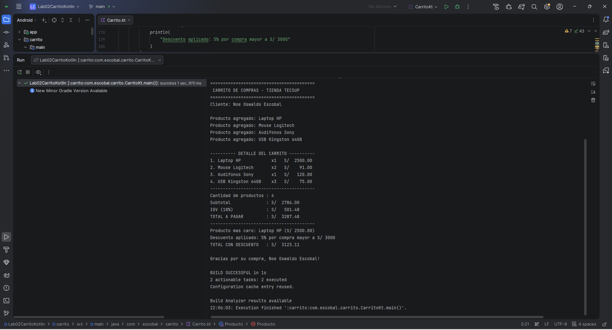

# Laboratorio 02 - Carrito de Compras en Kotlin

## Datos del estudiante

- **Estudiante:** Noe Oswaldo Escobal
- **Curso:** Programación en Móviles
- **Institución:** TECSUP
- **Laboratorio:** 02
- **Proyecto:** R1 - Proyecto sin IA

## Descripción

Este proyecto implementa un carrito de compras en Kotlin utilizando variables, tipos de datos, funciones, colecciones y estructuras de decisión.

El programa permite registrar productos con su nombre, precio y cantidad, calcular el subtotal de la compra, el IGV del 18%, el total a pagar, identificar el producto más caro y aplicar un descuento dependiendo del monto total.

## Conceptos utilizados

Durante el desarrollo del laboratorio se utilizaron los siguientes conceptos de Kotlin:

- `val` y `var`
- `String`, `Int` y `Double`
- `data class`
- `List`
- `MutableList`
- `mutableListOf()`
- `fun`
- `for`
- `if`
- `when`
- `return`
- Plantillas de String
- `String.format()`
- `maxByOrNull()`
- `find()`

## Modelo de datos

Los productos del carrito se representan utilizando una `data class`:

```kotlin
data class Producto(
    val nombre: String,
    val precio: Double,
    var cantidad: Int
)
```

Cada producto almacena:

- `nombre`: nombre del producto.
- `precio`: precio unitario del producto.
- `cantidad`: número de unidades del producto.

## Diferencia entre val y var

En Kotlin, `val` se utiliza para declarar una referencia que no puede ser reasignada después de ser inicializada.

Por otro lado, `var` permite modificar posteriormente el valor almacenado.

En la clase `Producto`:

```kotlin
val nombre: String
val precio: Double
var cantidad: Int
```

`nombre` y `precio` utilizan `val` porque representan información que no debería modificarse después de crear el producto.

`cantidad` utiliza `var` porque el número de unidades de un producto puede cambiar.

Si intentamos modificar `precio` después de crear un producto, Kotlin mostrará un error porque fue declarado utilizando `val`.

## Productos utilizados

| Producto | Precio unitario | Cantidad |
|---|---:|---:|
| Laptop HP | S/ 2500.00 | 1 |
| Mouse Logitech | S/ 45.50 | 2 |
| Audifonos Sony | S/ 120.00 | 1 |
| USB Kingston 64GB | S/ 25.00 | 3 |

## Funciones implementadas

### calcularSubtotal()

Calcula el subtotal sumando el precio por la cantidad de cada producto.

```text
subtotal = precio × cantidad
```

### calcularIGV()

Calcula el IGV correspondiente al 18% del subtotal.

### calcularTotal()

Suma el subtotal y el IGV para obtener el total de la compra.

### mostrarDetalle()

Muestra los productos del carrito de manera ordenada utilizando `String.format()` para alinear las columnas.

### calcularDescuento()

Utiliza una estructura `when` para determinar el descuento correspondiente:

- Compra mayor a S/ 5000: descuento del 10%.
- Compra mayor a S/ 3000: descuento del 5%.
- En otro caso: no se aplica descuento.

### buscarProducto()

Permite buscar un producto dentro del carrito utilizando su nombre mediante la función `find()`.

## Resultado final

El programa obtiene los siguientes resultados:

- **Cantidad de productos:** 4
- **Subtotal:** S/ 2786.00
- **IGV (18%):** S/ 501.48
- **Total a pagar:** S/ 3287.48
- **Producto más caro:** Laptop HP
- **Descuento aplicado:** 5%
- **Total con descuento:** S/ 3123.11

## Evidencia de ejecución

La siguiente captura muestra la ejecución final del programa:

